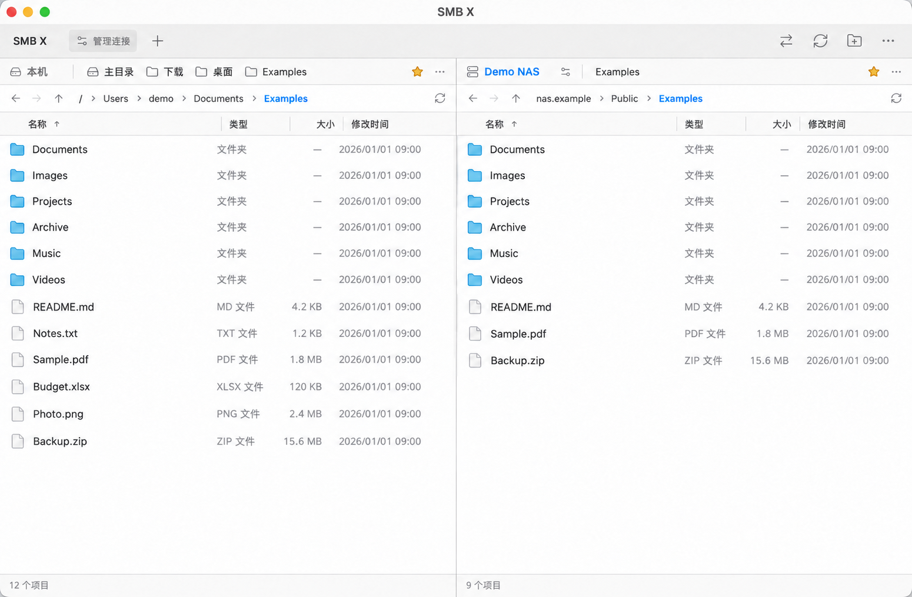

# SMB X

轻量的 macOS / Windows 双栏 SMB 文件管理与传输工具，采用 MIT 开源协议。

- 双栏浏览本地文件与 SMB 共享，支持上传、下载、复制、移动及跨栏拖拽。
- SMB2/3、共享枚举、自定义端口和 Domain；服务器与目录收藏。
- 分块传输、进度与速度、取消、失败重试、同名文件冲突处理。
- 密码可保存在 macOS Keychain / Windows Credential Manager，不写入普通配置文件。
- 简体中文 / English / 跟随系统；Tauri 2 使用系统 WebView，无需打包 Chromium。

## 界面预览



上图由实际界面截图经 AI 编辑脱敏：用户名、服务器地址、文件名与日期均为示例内容，仅用于展示布局。

## 下载与安装

请从 [GitHub Releases](https://github.com/imxiaolee/smb-x/releases/latest) 下载，不需要安装 Node.js 或 Rust。

| 平台 | 下载文件 | 使用方式 |
| --- | --- | --- |
| macOS 11+，Apple Silicon | `SMB-X-v1.0.0-macOS-arm64.dmg` | 打开 DMG，将 `SMB X.app` 拖入 Applications |
| Windows 10/11 x64 | `SMB-X-v1.0.0-Windows-x64.zip` | 解压后运行 `SMB-X/SMB X.exe`，无需安装应用 |

当前不提供 Intel Mac 版本。Windows 使用 [Microsoft Edge WebView2 Runtime](https://developer.microsoft.com/microsoft-edge/webview2/)，Windows 11 通常已包含；缺少时请先安装该运行时。免安装版不会自动安装运行时，用户配置仍保存在系统应用配置目录。Windows 版本目前未签名。

### macOS 首次打开

当前应用只有 ad-hoc 签名，**未经过 Apple Developer ID 签名和 Apple 公证（notarization）**，下载后可能被 Gatekeeper 阻止。确认文件来自本仓库且校验通过后，将应用放入 `/Applications/`，按需执行：

```bash
xattr -dr com.apple.quarantine "/Applications/SMB X.app"
open "/Applications/SMB X.app"
```

第一条命令会移除该应用的下载隔离标记，请只对你信任的下载使用。之后也可以在 Finder 中双击打开。未来加入 Developer ID 签名和公证后将更新这部分说明。

macOS 可能提示访问桌面、文稿、下载目录或局域网，请按实际需要授权。

### 校验下载文件

同一 Release 提供 `SHA256SUMS.txt`。macOS 可以执行 `shasum -a 256 <下载文件>`，Windows PowerShell 可以执行 `Get-FileHash <下载文件> -Algorithm SHA256`，与清单中的对应哈希比较。

## 开发与构建

使用 Node.js 22、Rust stable。macOS 需要 Xcode Command Line Tools；Windows 需要 Visual Studio 的 Desktop development with C++ 工作负载、Windows SDK 和 WebView2 Runtime。

```bash
npm ci
npm test
npm run build
python scripts/third-party-notices.py
cargo test --locked --manifest-path src-tauri/Cargo.toml
npm run tauri dev
```

`npm run dev` 仅提供带示例数据的前端预览；真实文件操作需要运行 Tauri。许可证收集命令需要 Python 3 和 GitHub CLI，首次会让 Cargo 下载锁定的依赖，并联网读取对应固定提交的上游许可证。npm 与 Cargo 依赖均提交锁文件。

### GitHub Actions 发布

工作流为 [Release](.github/workflows/release.yml)。**普通分支 push 和 PR 不触发任何 Actions 构建。**

1. 修改源码并正常提交、推送。
2. 在 GitHub → Actions → Release → Run workflow 手动验证。手动运行测试、打包双平台并上传 Artifacts，不创建正式 Release。
3. 确认包可用，并使 `package.json`、`package-lock.json`、`Cargo.toml`、`Cargo.lock`、`tauri.conf.json` 的版本一致，再推送对应标签：

```bash
git tag v1.0.0
git push origin v1.0.0
```

只有 `v*` 标签 push 与手动操作会触发工作流。标签必须严格匹配源码版本。两个平台全部成功后，工作流生成校验清单、上传所有文件到草稿 Release，最后公开发布；构建失败不会发布不完整版本。手动构建产物保留 14 天。

macOS 使用 ARM64 runner 输出 DMG，Windows 输出只有一层 `SMB-X/` 的 ZIP。第三方许可在安装包中及 Release 附件中提供。构建只需 GitHub 自动提供的 `GITHUB_TOKEN`，发布任务仅申请 `contents: write`；当前不需要 Apple / Windows 签名 Secrets。

## 验证范围

自动化覆盖前端测试、双平台 Rust 测试、打包与启动冒烟检查。真实 NAS 互通、系统凭据存储和 macOS 人工交互仍需按 [验收清单](docs/ACCEPTANCE.md) 验证，不能用构建成功代替真机验收。

## 操作

- 点击某栏使其成为当前栏；点击栏标题中的磁盘/服务器可在本机和各连接实例之间切换。本机栏只显示本机收藏，各服务器栏只显示该连接实例的收藏；悬停收藏后点击 × 或右键可取消收藏。
- 地址栏支持本地绝对路径、`~`、`~/Downloads`，及 `smb://nas:445/share/path`。先添加共享连接，再输入该共享下的地址；特殊字符需 URL 编码。
- 拖动表头的列分隔线可调整相邻两列宽度；聚焦分隔线后可用左右方向键微调，双击恢复默认宽度。
- 单击选择，Cmd/Ctrl 单击增减选择，Shift 单击连续选择，方向键移动选择。
- 双击文件夹进入；双击本地文件用系统默认程序打开；双击远程文件确认后下载到本机 Downloads。没有 Downloads 时先创建它，或直接拖到另一栏指定目录。
- 拖到另一栏空白处复制到该目录，拖到具体文件夹复制到其内部。第一版不接收 Finder / Explorer 外部拖放。
- 右键菜单提供复制、剪切、粘贴、移动到另一栏、重命名、删除等；本机项目或当前目录还可选择“在访达中显示”。在 macOS 中复制本机项目会同时写入系统文件剪贴板，可切换到访达、桌面或其他程序粘贴；远程项目需先下载到本机。
- 服务器右侧齿轮可重新连接；右键服务器可移除连接与系统安全存储中的密码；右键收藏可取消收藏。
- 顶部“管理连接”第一层可直接编辑名称：聚焦名称时，输入框内右侧显示绿色勾，点击或按 Enter 单独保存；Esc 还原未保存的名称。右侧“编辑”打开连接参数窗口，点击“保存”仅保存配置，下次访问时连接；移除会清理该实例的收藏和已保存密码。
- 点击顶部双箭头图标打开紧凑的传输队列浮层；点击外部、关闭按钮或按 Esc 收起，新任务进入时自动打开。灰白工具栏、蓝色文件夹与选中态、28px 行高；正式桌面应用保留系统原生窗口装饰。

| 操作 | 快捷键 |
| --- | --- |
| 地址栏 | Cmd/Ctrl + L |
| 全选 | Cmd/Ctrl + A |
| 复制 / 剪切 / 粘贴 | Cmd/Ctrl + C / X / V |
| 新建文件夹 | Cmd/Ctrl + Shift + N |
| 刷新 | Cmd/Ctrl + R 或 F5 |
| 重命名 | F2 |
| 永久删除（先确认） | macOS Cmd + Backspace / Windows Delete |
| 上级 | Backspace 或 Alt + ↑ |
| 后退 / 前进 | Alt + ← / → |
| 打开所选项 | Enter |

## 数据保护与 MVP 边界

- 密码只经 IPC 传入 Rust，普通 JSON 仅保存连接元数据与收藏。勾选保存时使用系统安全存储，否则仅在进程内存保留，退出清除。系统安全存储报错会直接显示，不会退回明文保存。
- 替换先写目标目录里的 `.transx-<uuid>.part` 临时文件；成功关闭后将原目标改名为 `.backup`，提交新文件，再清理备份。提交失败会尝试恢复备份，并显示失败和恢复路径。
- 替换事务不是服务器端原子交换：断电、进程被强制结束、网络断线可能遗留 `.part` / `.backup`，甚至原文件暂时只以备份名存在。**不要直接批量删除 backup；先检查文件内容并恢复需要的原文件。**
- 同名目录合并；同名文件逐个询问。文件 / 目录类型冲突只能跳过、取消或改名后重试，不递归覆盖另一种类型。
- 移动采用逐文件「复制成功 → 检查源大小/修改时间 → 删除源」。整个目录不是原子移动，失败时可能部分已移动；剩余源文件保留，重试重新扫描。
- 取消在块间检查；正在等待 SMB 回应时要等当前请求完成或超时（单请求约 30 秒），清理另需网络时间。取消不会回滚已完成文件，可能留下已创建的空目录。
- 第一版没有持久队列、断点续传、文件锁或内容哈希快照；请避免传输期间由其他软件修改源/目标文件。
- 不复制本地符号链接，不保留 ACL、扩展属性、资源叉、Finder 标签或原始修改时间。macOS `.app` 包、照片库等需要元数据的内容建议先归档再传输。SMB 服务端的重解析点和别名行为取决于服务器，尚待互通测试。
- 路径自复制检查覆盖相同本地规范路径、相同 host / port / share 的连接；不同 DNS 别名、嵌套共享或系统挂载映射到同一位置时，无法保证识别。不要向同一目录的别名复制。
- 单次入队最多 1,000 项，单个目录任务扫描最多 200,000 项；已结束任务可手动清理。
- SMB 使用 NTLM 用户名/密码认证，每个已保存服务器复用一个会话，并在网络断开后自动重连；禁用 DFS 自动跳转与压缩。不支持 SMB1、Kerberos SSO、共享自动发现、同步或搜索。

## 代码地图

```text
src/main.ts                     双栏 UI、键盘、拖放、确认窗口、传输队列
src/core.ts                     路径、排序、虚拟列表计算、数据模型
src-tauri/src/main.rs            Tauri 命令与参数边界
src-tauri/src/model.rs           Rust 数据模型和名称检查
src-tauri/src/provider.rs        FileSystemProvider / Local / SMB、分块读写
src-tauri/src/state.rs           连接元数据、系统凭据、设置持久化
src-tauri/src/transfer.rs        队列、冲突、取消、临时文件、提交/回滚
docs/ACCEPTANCE.md               真机与 NAS 验收清单
```

参考：[Tauri](https://v2.tauri.app/)、[smb2](https://github.com/vdavid/smb2)、[keyring 3.6.3](https://docs.rs/keyring/3.6.3/keyring/)。


## 界面语言

macOS：应用菜单 → 设置…（Cmd+,）→ 语言；Windows：标题栏设置按钮。支持跟随系统、简体中文与 English。语言偏好保存在本机 WebView 存储，切换保留两栏位置，后台传输继续运行。底层系统或服务器诊断可能保留原文。

## 许可证与第三方组件

本项目采用 [MIT License](LICENSE)。主要依赖包括 Tauri（MIT / Apache-2.0）、smb2、keyring 和 Lucide；各组件遵守自己的许可证。构建时从锁定的依赖源码收集许可文本，随安装包与 Release 附件分发。MPL-2.0 组件的未修改源码另附于 `THIRD_PARTY_SOURCES.tar.gz`，其源文件继续适用 MPL。详细审查范围见 [发布检查记录](docs/OPEN_SOURCE_REVIEW.md)。
